# Sequence to Sequence Models for Language Processing

Before exploring the specific mathematical concepts of sequence to sequence models, let's begin with high-level understanding of what goes on behind the scenes of language translation. Consider the early attempts in the past, when dictionaries or grammar books were relied upon for word translations, and contrast that with modern machine translation systems like Google Translate. Sequence to sequence models for machine translation essentially operate on a similar principle but with the use of advanced algorithms to perform translations. These evolutionary translations systems such as machine language translators have fascinated humans for centuries. Machine translation technology came after the advent of digital computing and the advancements in technology have significantly improved our ability to overcome language barriers, which has long been a fundamental challenge for linguists, computer scientists, and language learners alike. They have been adapted in technology and are used to translate between human languages such as the online translation websites that people use to assimilate content that is not in their native language (Neubig et al. 2017). The machine translation system as part of the sequence to sequence models operates on the same principle of Google's translation system, where we have an input and an output. The input corresponds to the source language while the output to the target language. Machine translation can be described as the process of transforming a sequence of words in the source language into an effective model that enables accurate conversion across a wide range of languages (Neubig et al. 2017). Machine translation is a well known practical example of  sequence to sequence models.

One aspect that is particularly motivating about sequence to sequence models for language translation is their ability to bridge communication gaps and foster understanding across different languages and cultures. By leveraging sequence to sequence models, we can facilitate accurate translations between languages, enabling people to connect, share ideas and collaborate on a global scale.

## What is sequence to sequence models and its Application to Natural language translation?

Sequence to sequence models which are also referred to as Seq2Seq models are a type of neural network architecture that are designed to map sequences and are applicable for tasks where the input and output are both sequences of variable length. Seq2Seq models are particularly popular and effective in a field with language translation tasks, which includes text summarization, dialogue generation, conversation modeling and machine translation, where the goal is to convert text sequence from one form of sequences to another. They have also been extended to handle more complex input and output types, such as image captioning and speech recognition (Cho et al. 2014). Seq2Seq models encompass a wider range of models that involve mapping one sequence to another as mentioned earlier. While machine translation falls within this category, it also encompasses a diverse range of other methods utilized for various tasks (Neubig et al. 2017). Consider a computer program as a system that receives a sequence of input bits and produces a sequence of output bits. Examples of this sequence conversion are shown below.

<center>
  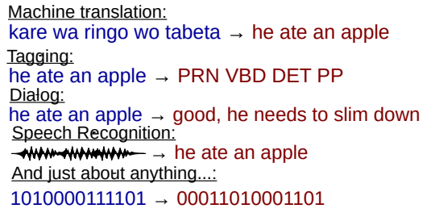
</center>

The development of Seq2Seq models has brought about significant transformation in machine translation. These models have revolutionized the field by enabling the creation of highly accurate and efficient translation systems. With the use of Seq2Seq models, researchers have achieved impressive speed and accuracy in translating between multiple languages. One remarkable feature of these models is their capacity to learn from extensive and diverse datasets, leading to continuous improvements over time. This continuous improvement enhances the models’ fluency and accuracy, ultimately enabling them to achieve near- human-level translation quality.


## The Seq2Seq (Encoder- Decoder) Model

For this review we will focus on the Encoder-Decoder seq2seq model for machine translation. The encoder and decoder components are both recurrent neural networks (RNNs) that work together to handle the task of machine translation. This type of model is a RNN-based model with recurrent structure from a non-fixed-sized sequence input to an non-fixed-sized sequence output. That is to say one RNN encodes a sequence of symbols and transforms them into a fixed-length vector representation, and the other decodes the representation into another sequence of symbols that has non-fixed length (Cho et al. 2014). Typically the encoder network, takes a sequence of input tokens (words, characters, etc) and transforms them into a fixed-size vector representation called “context vector” or “thought vector” and then the decoder network uses this context vector as input which is referred to as an initial hidden state, and generates each output token in a loop until a special “end-of-sequence” token is generated indicating the output vector sequence. For our project, we have a RNN-based model that reads in a sentence in English and then outputs a sentence in French.


<center>
  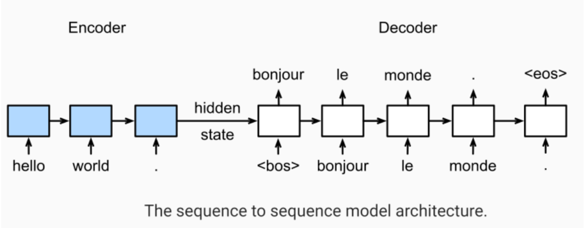
</center>

As shown from the image above, the encoder takes the source language sentence, and the decoder part generates the translated sentence in the target language based on the encoded representation. The model maps an input sequence to an output sequence, with the input and output being of different length and at the end there is an end of sequence. In other words the encoder captures the meaning of the source sentence, while the decoder generates the corresponding translation token by token (word by word or character by character).

<center>
  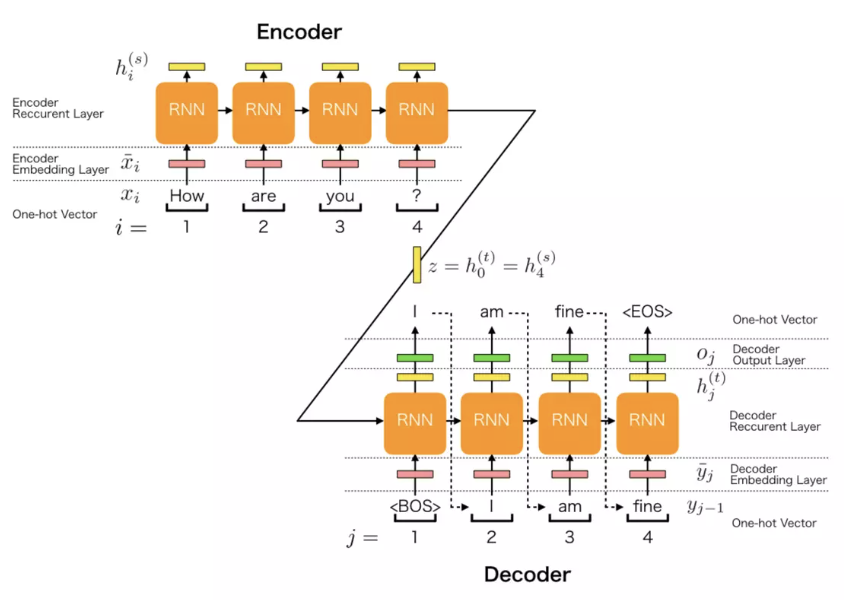
</center>

The encoding part has the encoder embedding and the recurrent layer. When processing the ith word in the input sentence, the encoder embedding layer converts each word in the input sentence to the embedding vector and each embedding vector is generated as follows

<center>
  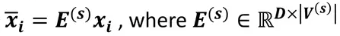
</center>

Once this is given, now during the processing of the ith embedding vector, the encoder recurrent layer generates each hidden vector from each embedding vector. Each hidden vector is calculated in the following process, where phi is the Long Short Term Memory variant:

<center>
  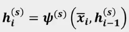
</center>

On the other hand, the decoder which gives the output (target sentence) has three components: Decoder Embedding layer, Decoder Recurrent Layer and Decoder output layer. The embedding layer converts each word in the output sentence to the embedding vector which represents the (j-1)th word (output). The output for the embedding vector is calculated by the following formula:

<center>
  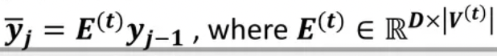
</center>

Where y_(j-1) is the one-hot vector (input) which represents the (j-1)th word generated by the decoder output layer. The decoder recurrent layer then now generates the hidden vectors from the previously generated embedding vectors, and each hidden vector is given by the following:

<center>
  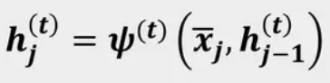
</center>

Lastly, the decoder output layer generates the probability of the j-th word of the output sentence from the hidden vector above, and each probability of the jth word is given by the following:

<center>
  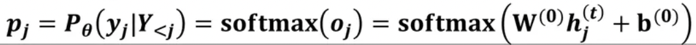
</center>

The softmax activation function is used to determine the probability distribution over the target vocabulary at each decoding step, where the output of the decoder is passed through a softmax function which takes a vector of arbitrary values and normalizes them into a probability distribution (Cho et al. 2014). By applying the softmax activation function,the model is able to transform the output of the decoder’s hidden layer into a probability distribution. The highest probability corresponds to the most probable word at each decoding step, enabling the model to select the most likely prediction, which aids in generating coherent and accurate translations.

The RNN Encoder-Decoder seq2seq model benefits from the inherent ability of RNNs to handle sequential data, allowing it to capture the dependencies between input and output sequences. It may however, suffer from limitation of standard RNNs in modeling long-term dependencies. In that case, variants such as Long Short Term Memory (LSTM) are used in the encoder and decoder components to mitigate the vanishing gradient problem and better capture long-range dependencies (Ilya et al. 2014). For this review we will use LSTM to map the input sequence to a vector of a fixed dimensionality, and also another deep LSTM to decode the target sequence from the vector.

The model is then trained to optimize the likelihood of the target sequence given the source sequence. Essentially, the objective function in the model is optimized to minimize the discrepancy between the predicted translation (output sequence) and the target translations (output sequence). Typically the objective function that is used in these tasks is the cross-entropy loss function, also known as the negative log-likelihood loss function. This loss function quantifies the dissimilarity between the predicted probability distribution over the target vocabulary and the true distribution of the target words at each time step.

The objective function is formulated as the average negative log-likelihood loss over all time steps and is given as below:

<center>
  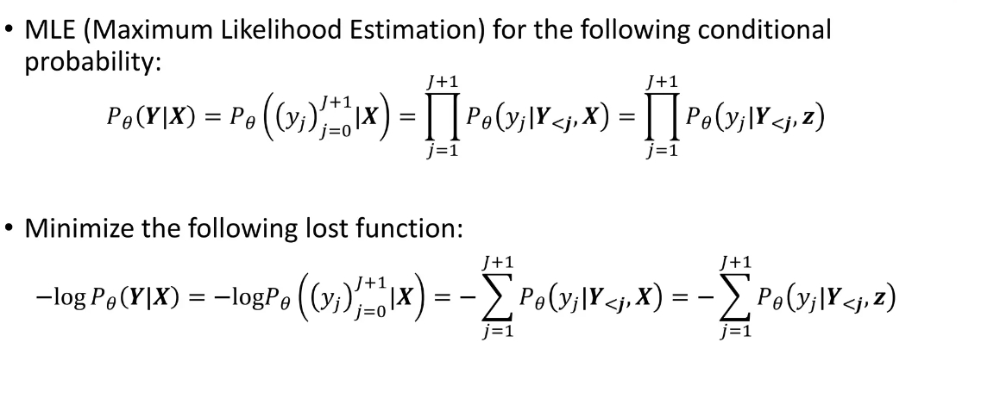
</center>

The MLE is applied to the conditional probability of generating the target sequence (Y) given the source sequence (X). This is done by minimizing the negative log-likelihood (NLL) of the target sequence given the model’s predictions. 

Mathematically, the MLE objective function here is expressed:
Objective = -sum(log(P(y_j|y_1,....,y_({j-1},z))), where P(y_j,...,y_{j-1},z) represents the conditional probability of generatinng the j-th target token y_j given the previously generated token y_1: y_{j-1} and the context vector z. By minimizing the negative log-likelihood, the model is encouraged to assign higher probabilities to the correct target tokens and penalize lower probabilities for incorrect predictions. This optimization process guides the model to learn the parameters that maximize the likelihood of generating the correct output sequences. 


# Application

Now that we have gained some mathematical knowledge about sequence to sequence models in machine translation, we can apply them using existing data. For this part, we will be building a charachter level seq2seq model for language translation. The [data](https://www.manythings.org/anki/) we are going to use is a data frame with sentence pairs in which the first column is the input texts (English texts) and the second column is the target texts (French texts). Small part of the data is also shown below. Notice that sometimes the same English phrase can have different translations in French. The dimension of our data set is 10000 rows of sentence pairs and 2 columns.

| Input   | Target                       | 
|:--------|:-----------------------------|
|  Go.    |                       Va !   |
|  Go.    |                    Marche.   |
|  Hi.    |                    Salut !   |
|  Hi.    |                     Salut.   |
| Run!    |                    Cours !   |
| Run!    |                   Courez !   |
| Begin.  |                   Commencez. |
| Begin.  |                     Commence.|

The R packages we will be using for the model implementation are shown below. The **keras** package is a high-level neural networks API developed with a focus on enabling fast experimentation which is very useful in Seq2Seq modeling. The **data.table** and **stringr** packages are used to help us read in the text data file and clean or modify the data to our desired form.

```r
library(keras)
library(data.table)
library(stringr)
```

## Data Vectorization

Before we start modeling, it is important that we have the data vectorized so that the encoder-decoder part of the model can process our input texts and target texts. Since our focus is a character level seq2seq model, we need to split the texts into letters and maps them by creating vectors of the unqiue letters (for word level seq2seq models, the texts will be spilted into unique words instead of letters). For the target texts, we also add string "\t" denoting begin of sentence and string "\n" denoting end of sentence, so that LSTM starts making predictions when the starting symbol "\t" is encountered and stops predicting when ending symbol "\n" is encountered.

```r
# vectorize the data.
input_texts  <- text[[1]]
input_texts  <- lapply( input_texts, function(s) strsplit(s, split="")[[1]])
# add bos and eos to the target texts
target_texts <- paste0("\t", text[[2]], "\n")
target_texts <- lapply( target_texts, function(s) strsplit(s, split="")[[1]])

input_characters  <- sort(unique(unlist(input_texts)))
target_characters <- sort(unique(unlist(target_texts)))
# based on the unique characters, we create tokens for the texts
num_encoder_tokens <- length(input_characters)
num_decoder_tokens <- length(target_characters)
max_encoder_seq_length <- max(sapply(input_texts,length))
max_decoder_seq_length <- max(sapply(target_texts,length))
```

> Number of samples: 10000 
> 
> Number of unique input tokens: 70
> 
> Number of unique output tokens: 93
> 
> Max sequence length for inputs: 14
> 
> Max sequence length for outputs: 59

## Encoder-Decoder Modeling

For model tuning, there are several parameters that we may want to vary based on the purpose of the model in order to get more accurate predictions. The parameters are the batch size, epochs, and latent dimensionality of the encoding space. When modeling the encoder-decoder part with the LSTM layers, it is very important that we use a suitable "units" input. The units parameter in the LSTM layer is the latent dimensionality of the encoding space, which gives the model its capacity to learn the data and like hidden layers/neurons in a feed-forward algorithm, we don't want it to be too small (under-fit) or too large (over-fit). Given the number of samples that we have (10000 sentence pairs), we can use 512 units for the latent dimension. In the case that we chose a unit value that is too small, the model usually fails to learn the targeted sequences and produced very interesting and funny outputs that does not make sense. Two examples of funny outputs are shown below:

> Input sentence  :  I'm no rebel. 
> 
> Target sentence :  Je ne suis pas un rebelle. 
> 
> Decoded sentence:  Je se sais ais ss ais ss aiss ss aiss sss ss ais ss ais ss 

> Input sentence  :  It's possible. 
> 
> Target sentence :  C'est possible. 
> 
> Decoded sentence:  C'es s ais ais ss aiss ss ss ais ss ais ss aiss ss aiss ss 

Below we have the encoder and decoder to process the input sequence with a LSTM layer unit of 512. Note that the overall structure of our model is implemented based on the character level Seq2Seq model example from the [Keras page](https://keras.io/examples/nlp/lstm_seq2seq/) and R codes from Keras' [Github repository](https://github.com/rstudio/keras/blob/main/vignettes/examples/lstm_seq2seq.R). Also notice that we also considered the dropout method when modeling the encoder and decoder to prevent overfiting. The dropout method can be used in different layers depends on what is actually causing the overfitting. In our case, a dropout rate of 0.2 in the LSTM decoder reduces overfitting in our model.

```r
# lstm layer units/latent dimension
latent_dim <- 512
# dropout method
dropout_rate <- 0.2

# define an input sequence and process it.
encoder_inputs  <- layer_input(shape=list(NULL, num_encoder_tokens))
encoder <- layer_lstm(units=latent_dim, return_state=TRUE)
encoder_results <- encoder_inputs %>% encoder
# discard encoder_outputs and keep the states for decoder.
encoder_states  <- encoder_results[2:3]

# use encoder_states as initial state.
decoder_inputs  <- layer_input(shape=list(NULL, num_decoder_tokens))
# return full output sequences from decoder and return internal states for inferences
decoder_lstm <- layer_lstm(units=latent_dim, return_sequences=TRUE,
                           return_state=TRUE, dropout = dropout_rate)
decoder_results <- decoder_lstm(decoder_inputs, initial_state=encoder_states)
decoder_dense <- layer_dense(units=num_decoder_tokens, activation='softmax')
decoder_outputs <- decoder_dense(decoder_results[[1]])
```

Then, using the processed input data from the encoder and decoder we can define the main model. The optimizer for our model is rmsprop which is similar to the gradient descent algorithm with momentum and usually works well with neuron networks. We also have categorical cross-entrophy as the loss function since we are working with text data. Additionally, the batch size for our model is 128 since we have a large dataset, we want a larger batch size that can give faster progress in training. For the epoch value, we can start with 100 epochs and decide whether we want to change the value based on the model performance with validation. For validation, our split is 25% for the test set.

```r
batch_size <- 128
epochs <- 100

# main model that will turn encoder-decoder input data into decoder target data
model <- keras_model( inputs = list(encoder_inputs, decoder_inputs),
                      outputs = decoder_outputs)

## compile
model %>% compile(optimizer='rmsprop', loss='categorical_crossentropy')

## run mocel fit
model %>% fit( list(encoder_input_data, decoder_input_data), decoder_target_data,
               batch_size=batch_size,
               epochs=epochs,
               validation_split=0.25)
```

Using the model we built, we can then translate input English phrase to French phrase. We randomly select 10 English sentences from the data set and translate them to French. The translated result is shown below.

| Input          | Target                    | Output           |
|:-------------  |:------------------        |:------           |
| Many thanks.   | Merci bien.               | Merci bien.  |
| Skiing is fun. | C'est amusant de skier.   | Fais attention.  |
| I felt happy.  | Je me suis senti heureux. | Je me suis senti ar te. |
| Write to Tom.  | Écrivez à Tom.            | Avent-nous pertie.  |
| You're upset.  | Tu es contrarié.          | Tu es contrarié.  |
| I'm not armed. | Je ne suis pas armée.     | Je ne suis pas un part.|
| Did Tom try?   | Est-ce que Tom a essayé ? | Tom a-t-il déchous ? |
| I feel silly.  | Je me sens stupide.       | Je me sens seule. |
| Let me see it. | Laisse-moi la regarder !  | Laissez-moi partir. |
| Stop Tom.      | Arrête Tom.               | Arrête Tom.  |

From the translated results above, we can see that sometimes the translations can be very close and accurate and sometimes the translations can be way off. But overall, the produced outputs from our character level Seq2Seq model captures the sentence structure of the target sentences where the first character is always capitalized, space between words, and sentences are ended with a punctuation. To get more accurate translations, we might need to build a more complex model with more layers and more neurons for it to recognize longer and more complicated patterns, and consider trying out different values of latent dimensionality and optimizers. 

We can also evaluate the performance of the model using the plot of the loss function.

<figure>
  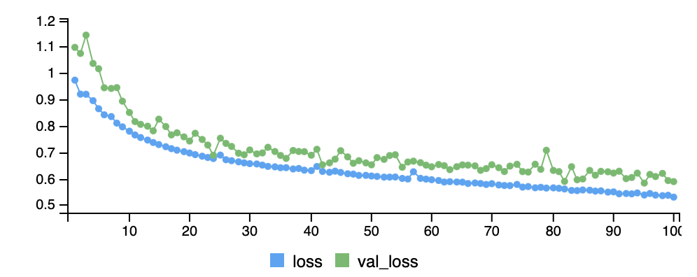
</figure>

From the plot above, we can see that out model is overfitting a little since the validation loss curve is above the loss curve. But overall, the two curves are still fairly close and ending at epochs = 100 seems suitable in this case.

## Another example: English to Chinese Pinyin

Now that we have tried translating English to French using our Seq2Seq model, we can also use this model to translate other languages to see possible differences in translation results and for fun! In this section, we will be translating English sentences to Chinese sentences and the [data](https://www.manythings.org/anki/) can still be found on the same website. However, we have to realize the limitation of our implemented model that when the number of unique characters is too large, it would be very computationally expensive and time consuming to process the sequences (note that there are more efficient neuron network models that can directly translate English to Chinese but our model is a very basic character level sequence to sequence model). Given the nature of the Chinese language, it would be very inefficient to vectorize every unique Chinese characters since there are over 2000 unique Chinese characters in our data set. Instead we can convert the Chinese characters to pinyin using the **pinyin** package. In this way the number of unique characters can be reduced from 2000+ to 84. Below, we have a dataframe showing some of the input texts (English), target texts (Chinese pinyin), and original target texts (Chinese).

| Input          | Original Target           | Target           |
|:-------------  |:------------------        |:------           |
|    Hi.   |   嗨。      |     hāi . |
|    Hi.   |  你好。     |   nǐ hāo . |
|   Run.   | 你用跑的。   | nǐ yòng pǎo de . |
|    Stop! |    住手！   |  zhù shǒu ! |
|  Wait!   |  等等！     | děnɡ děnɡ ! |
|  Wait!   | 等一下！    | děnɡ yī xià ! |
| Begin.   |  开始！     |  kāi shǐ !  |
| Hello!   |  你好。     |   nǐ hāo .  |
| I try.   | 我试试。    | wǒ shì shì .|
| I won!   | 我赢了。    | wǒ yíng le .|

Using the same sequence to sequence model we just built, we can randomly select 10 English sentences from the data set and generate Chinese pinyin translations for English inputs. Below we have the translated results shown.

| Input          | Target                    | Output           | Original Target |
|:-------------  |:------------------        |:------           | :----------      |
| They didn't act quickly. | tā men méi lì kè xīnɡ dònɡ .| tā mén bú shì xīnɡ dònɡ  | 他们没有立刻行动。|
| I was at home. | wǒ ɡānɡ cái zài jiá.   | wǒ zhī dǎo nǐ de .  | 我刚才在家。 
| Please continue.  | qǐng jì xù . | qǐng ɡuān de . | 请继续。 
| Tom can swim pretty well.  | tānɡ mǔ yóu de hěn hǎo . | tānɡ mǔ shì ɡàn hǎo de   | 汤姆游得很好。
| She asked him for help.  | tā xiànɡ tā qiú zhú .| tā shì tānɡ mǔ .  | 她向他求助。 
| I couldn't leave Tom. | wǒ bú néng lī kāi tānɡ mǔ . | wǒ bú néng lī kāi yāo shì .| 我不能离开汤姆。
| A good idea came to him.   | tā xiǎnɡ dào yī ɡè hǎo zhú yī .| nǐ nái zài shì tānɡ mǔ de . | 他想到一个好主意。
| I'm not a dictator.  | wǒ bú shì dú cái zhě | wǒ bú shì shānɡ mǔ de . | 我不是独裁者。 
| Hand me my towel. | bānɡ wǒ dài yī xià máo jīn .  | nǐ zài shén mɑ de . | 帮我带一下毛巾。 
| I'll do it.      | wǒ huì zuò de .               | wǒ huì zuò de . | 我会做的。

From the above result, we can see that the accuracy of the translation is not as good as the French translations and this could be because of the longer and more complicated sequence of pinyin. Looking at the target column and the output column, we can see that our translated results still captured some similar patterns of the target pinyin. It is also interesting to see that in the first row, where the word "didn't" is successfully translated to "bú shì" which is another way of expressing "méi" in Chinese. Below, we also have the plot of the loss function.
 
 <figure>
  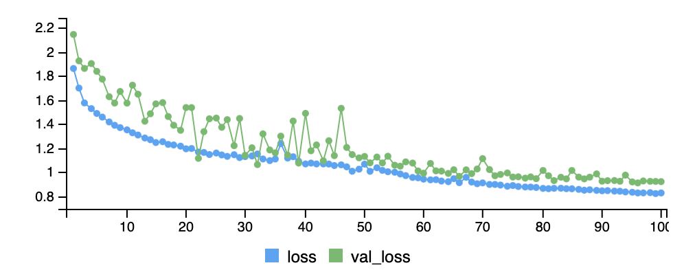
</figure>
 
From the plot, we can see that there are more fluctuations compared to the plot from the English to French translation. These fluctuations could be due the fact that we have longer and more complex target sequences and thus the values from the loss function are also larger.

# Conclusion

The character-level Seq2Seq models have shown some promising results in translating English to French, demonstrating their effectiveness in capturing the linguistic nuances between these two languages. The model’s ability to handle the intricate details at the character level contributes to its better performance in this language pair. However, when translating English to Chinese, the model’s performance was found to be  more average. This discrepancy may be attributed to the significant differences in the linguistic structure and complexity between English and Chinese characters, making it more challenging for the character level model to capture the necessary semantic and syntactic information accurately. Also note that it is more often to have word level Seq2Seq model instead of character level Seq2Seq models. And we do see from our translation result that, longer phrases are translated less accurately and problem may be resolved with a word level model. Overall, our review gives a basic example of how sequence to sequence model can be used for language processing problems and more features and model architectures can be explored to get accurate and efficient translations.

# Reference
[1] Neubig, G. (2017, March 5). Neural machine translation and sequence-to-sequence models: A tutorial. arXiv.org. https://arxiv.org/abs/1703.01619 

[2] Cho, K., van Merrienboer, B., Gulcehre, C., Bahdanau, D., Bougares, F., Schwenk, H., &amp; Bengio, Y. (2014, September 3). Learning phrase representations using RNN encoder-decoder for statistical machine translation. arXiv.org. https://arxiv.org/abs/1406.1078 

[3] Sutskever, I., Vinyals, O., &amp; Le, Q. V. (2014, December 14). Sequence to sequence learning with Neural Networks. arXiv.org. https://arxiv.org/abs/1409.3215 

[4] Jagfeld, G., Jenne, S., &amp; Vu, N. T. (2018, October 11). Sequence-to-sequence models for data-to-text natural language generation: Word- vs. character-based processing and output diversity. arXiv.org. https://arxiv.org/abs/1810.04864 

[5] Keras Team. (n.d.). Keras documentation: Character-level recurrent sequence-to-sequence model. Keras. https://keras.io/examples/nlp/lstm_seq2seq/ 

[6] Tf.keras.layers.LSTM&nbsp;  tensorflow V2.12.0. TensorFlow. (n.d.). https://www.tensorflow.org/api_docs/python/tf/keras/layers/LSTM 


